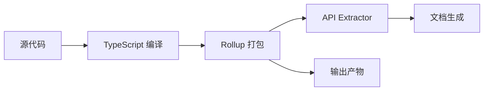

# 开发者文档

本文档为 Robinson 项目的开发者提供详细的技术指导和最佳实践。

## 目录

1. [项目架构](#项目架构)
2. [开发环境设置](#开发环境设置)
3. [模块开发指南](#模块开发指南)
4. [API 设计原则](#api-设计原则)
5. [性能优化指南](#性能优化指南)
6. [测试策略](#测试策略)
7. [发布流程](#发布流程)
8. [常见问题](#常见问题)

## 项目架构

### 整体架构

Robinson 采用模块化架构，按功能领域组织代码：

```
src/core/
├── array/          # 数组操作相关函数
├── boolean/        # 布尔值相关函数
├── color/          # 颜色转换和验证
├── common/         # 通用工具函数
├── date/           # 日期处理函数
├── file/           # 文件操作相关函数
├── function/       # 函数式编程工具
├── math/           # 数学计算函数
├── number/         # 数字处理函数
├── object/         # 对象操作函数
├── string/         # 字符串处理函数
├── symbol/         # Symbol 相关函数
└── web/            # Web/DOM 操作函数
```

### 核心设计原则

1. **单一职责**：每个模块只负责一个功能领域
2. **类型安全**：充分利用 TypeScript 的类型系统
3. **零依赖**：尽量减少外部依赖，保持轻量级
4. **向后兼容**：API 变更时保持向后兼容性
5. **性能优先**：优化常用函数的性能

### 构建流程



## 开发环境设置

### 必需工具

```bash
# Node.js (推荐 v16+)
node --version

# pnpm 包管理器
npm install -g pnpm

# Git 版本控制
git --version
```

### 项目设置

```bash
# 1. 克隆仓库
git clone https://github.com/An-Lijun/Robinson.git
cd Robinson

# 2. 安装依赖
pnpm install

# 3. 验证环境
pnpm test
pnpm lint
```

### 开发工具配置

#### VSCode 推荐配置

```json
{
  "typescript.tsdk": "node_modules/typescript/lib",
  "editor.formatOnSave": true,
  "editor.codeActionsOnSave": {
    "source.fixAll.eslint": true
  },
  "files.associations": {
    "*.ts": "typescript"
  }
}
```

#### Git Hooks

项目使用 Husky 进行 Git Hooks 管理：

```bash
# pre-commit hook 会自动运行
# - ESLint 检查
# - 测试运行
```

## 模块开发指南

### 创建新模块

#### 1. 创建模块目录结构

```plaintext
src/core/module-name/
├── src/
│   └── index.ts          # 模块源代码
├── test/
│   └── functionName.test.js  # 测试文件
└── index.ts              # 模块导出文件
```

#### 2. 编写模块代码

```typescript
// src/core/module-name/src/index.ts

/**
 * @beta
 * @description 函数描述
 * @param {Type} paramName - 参数说明
 * @returns {ReturnType} 返回值说明
 * @example
 * ```typescript
 * const result = functionName('param');
 * console.log(result); // expected output
 * ```
 */
export function functionName<T>(paramName: Type): ReturnType {
  // 实现逻辑
  return result;
}
```

#### 3. 编写测试

```javascript
// src/core/module-name/test/functionName.test.js

import { functionName } from '../../../index';

describe('functionName', () => {
  test('should work correctly', () => {
    const result = functionName('test');
    expect(result).toBe('expected');
  });

  test('should handle edge cases', () => {
    expect(functionName(null)).toBe(null);
    expect(functionName(undefined)).toBe(undefined);
  });
});
```

#### 4. 更新模块导出

```typescript
// src/core/module-name/index.ts
export * from './src/index';
```

#### 5. 更新主入口

```typescript
// src/index.ts
export * from './core/module-name/index';
```

### 模块开发最佳实践

#### 类型定义

```typescript
// ✅ 推荐：使用泛型
export function mapArray<T, U>(
  array: T[],
  mapper: (item: T) => U
): U[] {
  return array.map(mapper);
}

// ❌ 不推荐：使用 any
export function mapArray(array: any[], mapper: any): any[] {
  return array.map(mapper);
}
```

#### 错误处理

```typescript
// ✅ 推荐：明确的错误类型
export function divide(a: number, b: number): number {
  if (b === 0) {
    throw new Error('Division by zero is not allowed');
  }
  return a / b;
}

// ❌ 不推荐：静默失败
export function divide(a: number, b: number): number {
  if (b === 0) return 0;
  return a / b;
}
```

#### 性能优化

```typescript
// ✅ 推荐：使用原生方法
export function isEmpty(obj: object): boolean {
  return Object.keys(obj).length === 0;
}

// ❌ 不推荐：手动遍历
export function isEmpty(obj: object): boolean {
  for (const key in obj) {
    return false;
  }
  return true;
}
```

## API 设计原则

### 命名约定

#### 函数命名

```typescript
// 判断函数：is + 形容词/名词
isArray, isEmpty, isNumber

// 获取函数：get + 名词
getNode, getChunkArray, getSize

// 设置函数：set + 名词
setData, setStyle, setAttribute

// 转换函数：to + 目标类型
toString, toNumber, toHex
```

#### 参数命名

```typescript
// ✅ 清晰的参数名
export function createUser(
  userName: string,
  userAge: number,
  userEmail: string
): User { }

// ❌ 不清晰的参数名
export function createUser(
  a: string,
  b: number,
  c: string
): User { }
```

### 函数签名设计

#### 参数顺序

```typescript
// ✅ 推荐：必选参数在前，可选参数在后
export function formatDate(
  date: Date,
  format?: string
): string { }

// ❌ 不推荐：可选参数在前
export function formatDate(
  format?: string,
  date: Date
): string { }
```

#### 返回类型

```typescript
// ✅ 推荐：明确的返回类型
export function findUser(id: number): User | undefined { }

// ❌ 不推荐：模糊的返回类型
export function findUser(id: number): any { }
```

### 向后兼容性

```typescript
// ✅ 推荐：使用默认参数保持兼容性
export function processData(
  data: string,
  options: ProcessOptions = {}
): Result { }

// ❌ 不推荐：破坏性变更
export function processData(
  data: string,
  options: ProcessOptions // 必选参数
): Result { }
```

## 性能优化指南

### 性能测试

```javascript
// 使用 Jest 的性能测试
describe('performance', () => {
  test('should process large arrays efficiently', () => {
    const largeArray = Array(10000).fill(0);
    
    const startTime = performance.now();
    processArray(largeArray);
    const endTime = performance.now();
    
    expect(endTime - startTime).toBeLessThan(100);
  });
});
```

### 优化技巧

#### 1. 避免不必要的计算

```typescript
// ✅ 推荐：缓存计算结果
const memoizedResult = useMemo(() => 
  expensiveCalculation(data), [data]
);

// ❌ 不推荐：重复计算
const result1 = expensiveCalculation(data);
const result2 = expensiveCalculation(data);
```

#### 2. 使用原生方法

```typescript
// ✅ 推荐：使用原生数组方法
export function filterArray<T>(array: T[], predicate: (item: T) => boolean): T[] {
  return array.filter(predicate);
}

// ❌ 不推荐：手动实现
export function filterArray<T>(array: T[], predicate: (item: T) => boolean): T[] {
  const result: T[] = [];
  for (const item of array) {
    if (predicate(item)) {
      result.push(item);
    }
  }
  return result;
}
```

#### 3. 减少内存分配

```typescript
// ✅ 推荐：重用对象
export function processItems(items: Item[]): Result[] {
  const result: Result[] = [];
  for (const item of items) {
    result.push(transform(item));
  }
  return result;
}

// ❌ 不推荐：创建不必要的中间对象
export function processItems(items: Item[]): Result[] {
  return items
    .map(item => ({ item, timestamp: Date.now() }))
    .map(obj => transform(obj.item))
    .map(obj => ({ ...obj, processed: true }));
}
```

## 测试策略

### 测试金字塔

```
        /\
       /  \
      / E2E \        (少量端到端测试)
     /--------\
    /  集成   \      (适量集成测试)
   /------------\
  /    单元测试    \   (大量单元测试)
 /----------------\
```

### 单元测试

```javascript
// 测试单个函数的行为
describe('getChunkArray', () => {
  describe('normal cases', () => {
    test('should split array into chunks', () => {
      const result = getChunkArray([1, 2, 3, 4, 5, 6], 2);
      expect(result).toEqual([[1, 2], [3, 4], [5, 6]]);
    });
  });

  describe('edge cases', () => {
    test('should handle empty array', () => {
      expect(getChunkArray([], 2)).toEqual([]);
    });

    test('should handle size larger than array', () => {
      expect(getChunkArray([1, 2], 5)).toEqual([[1, 2]]);
    });
  });

  describe('error cases', () => {
    test('should throw error for non-array input', () => {
      expect(() => getChunkArray('not array', 2)).toThrow(TypeError);
    });
  });
});
```

### 集成测试

```javascript
// 测试多个函数的协作
describe('data processing integration', () => {
  test('should process data end-to-end', () => {
    const rawData = [/* ... */];
    const filtered = filterArray(rawData, item => item.active);
    const transformed = mapArray(filtered, item => ({
      ...item,
      processed: true
    }));
    const chunked = getChunkArray(transformed, 10);
    
    expect(chunked).toHaveLength(5);
  });
});
```

### 测试覆盖率目标

- **整体覆盖率**：≥ 80%
- **核心模块覆盖率**：≥ 90%
- **边界情况覆盖**：100%

## 发布流程

### 版本号规范

遵循语义化版本控制 (Semantic Versioning)：

```
MAJOR.MINOR.PATCH

MAJOR：不兼容的 API 变更
MINOR：向后兼容的功能新增
PATCH：向后兼容的问题修复
```

示例：
- `1.0.21` → `1.1.0`：新增功能
- `1.1.0` → `1.1.1`：修复 Bug
- `1.1.1` → `2.0.0`：重大变更

### 发布步骤

```bash
# 1. 更新版本号
npm version patch  # 或 minor, major

# 2. 运行测试
pnpm test

# 3. 构建项目
pnpm build

# 4. 生成文档
pnpm genAllDocs
pnpm docs:build

# 5. 发布到 npm
npm publish

# 6. 推送标签
git push --tags
```

### 变更日志

更新 `CHANGELOG.md`：

```markdown
## [1.1.0] - 2024-01-15

### Added
- 新增深度比较函数 `deepEqual`
- 新增数据验证模块

### Changed
- 优化 `getChunkArray` 函数性能
- 改进 `hasClass` 函数实现

### Fixed
- 修复 `renderTmp` 函数的类型定义
- 修正文档注释中的错误

### Deprecated
- 旧的 `validate` 函数已被 `validateEmail` 替代
```

## 常见问题

### Q: 如何添加新的依赖？

**A**: 在添加新依赖之前，请考虑：

1. 是否真的需要这个依赖？
2. 能否用原生方法替代？
3. 依赖的体积和维护状态如何？

如果确实需要，添加到 `package.json`：

```bash
# 开发依赖
pnpm add -D dependency-name

# 生产依赖
pnpm add dependency-name
```

### Q: 如何处理 TypeScript 错误？

**A**: 常见的 TypeScript 错误和解决方案：

```typescript
// 错误：参数隐式具有 'any' 类型
// 解决：添加类型注解
function process(data: any) { }  // ❌
function process(data: DataType) { }  // ✅

// 错误：属性不存在于类型上
// 解决：使用类型断言或接口
const result = data.unknownProperty;  // ❌
const result = (data as DataType).unknownProperty;  // ✅
```

### Q: 如何优化构建体积？

**A**: 使用以下策略：

1. **Tree Shaking**：确保使用 ES 模块
2. **按需导入**：避免全量导入
3. **代码分割**：将大型函数拆分为小函数

```typescript
// ✅ 推荐：按需导入
import { getChunkArray } from 'robinson';

// ❌ 不推荐：全量导入
import * as robinson from 'robinson';
```

### Q: 如何调试测试失败？

**A**: 调试测试的技巧：

```bash
# 运行特定测试
pnpm test -- getChunkArray

# 运行特定测试文件
pnpm test -- testPath

# 显示详细输出
pnpm test --verbose

# 生成覆盖率报告
pnpm test --coverage
```

## 资源链接

- [项目文档](https://an-lijun.github.io/Robinson/)
- [TypeScript 文档](https://www.typescriptlang.org/docs/)
- [Jest 文档](https://jestjs.io/docs/getting-started)
- [Rollup 文档](https://rollupjs.org/introduction/)
- [贡献指南](./CONTRIBUTING.md)

---

如有其他问题，请在 [Issues](https://github.com/An-Lijun/Robinson/issues) 中提出。
